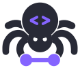

# ScrapeSchema


The generate schemas can be used to infer from document to use for tables in a database or for generating knowledge graph.

## Features

- **Entity Extraction**: Automatically identifies and extracts entities from PDF files.
- **Schema Generation**: Constructs a schema based and structure of the extracted entities.
- **Visualization**: Dynamic schema visualization

## Quick Start

### Prerequisites

Before you begin, ensure you have the following installed on your system:

- **Python**: Make sure Python 3.9+ is installed.
- **Poppler**: This tool is necessary for converting PDF to images.

#### MacOS Installation

To install Poppler on MacOS, use the following command:

```bash
brew install poppler

```

#### Linux Installation

To install Graphviz on Linux, use the following command:

```bash
sudo apt-get install poppler-utils
```

#### Windows

1. Download the latest Poppler release for Windows from [poppler releases](https://github.com/oschwartz10612/poppler-windows/releases/).
2. Extract the downloaded zip file to a location on your computer (e.g., `C:\Program Files\poppler`).
3. Add the `bin` directory of the extracted folder to your system's PATH environment variable.

To add to PATH:
1. Search for "Environment Variables" in the Start menu and open it.
2. Under "System variables", find and select "Path", then click "Edit".
3. Click "New" and add the path to the Poppler `bin` directory (e.g., `C:\Program Files\poppler\bin`).
4. Click "OK" to save the changes.

After installation, restart your terminal or command prompt for the changes to take effect.
If doesn't work try the magic restart button.

#### Installation
After installing the prerequisites and dependencies, you can start using ScrapeSchema to extract entities and their schema from PDFs.

Here’s a basic example:
```bash
git clone https://github.com/ScrapeGraphAI/ScrapeSchema
pip install -r requirements.txt
```

## Usage

```python
from scrapeschema import FileExtractor, PDFParser
import os
from dotenv import load_dotenv

load_dotenv()  # Load environment variables from .env file
api_key = os.getenv("OPENAI_API_KEY")

# Path to your PDF file
pdf_path = "./test.pdf"

# Create an LLMClient instance
llm_client = LLMClient(api_key)

# Create a PDFParser instance with the LLMClient
pdf_parser = PDFParser(llm_client)

# Create a FileExtraxctor instance with the PDF parser
pdf_extractor = FileExtractor(pdf_path, pdf_parser)

# Extract entities from the PDF
entities = pdf_extractor.generate_json_schema()

print(entities)
```
## Output
```json
{
  "ROOT": {
    "portfolio": {
      "type": "object",
      "properties": {
        "name": {
          "type": "string"
        },
        "series": {
          "type": "string"
        },
        "fees": {
          "type": "object",
          "properties": {
            "salesCharges": {
              "type": "string"
            },
            "fundExpenses": {
              "type": "object",
              "properties": {
                "managementExpenseRatio": {
                  "type": "string"
                },
                "tradingExpenseRatio": {
                  "type": "string"
                },
                "totalExpenses": {
                  "type": "string"
                }
              }
            },
            "trailingCommissions": {
              "type": "string"
            }
          }
        },
        "withdrawalRights": {
          "type": "object",
          "properties": {
            "timeLimit": {
              "type": "string"
            },
            "conditions": {
              "type": "array",
              "items": {
                "type": "string"
              }
            }
          }
        },
        "contactInformation": {
          "type": "object",
          "properties": {
            "companyName": {
              "type": "string"
            },
            "address": {
              "type": "string"
            },
            "phone": {
              "type": "string"
            },
            "email": {
              "type": "string"
            },
            "website": {
              "type": "string"
            }
          }
        },
        "yearByYearReturns": {
          "type": "array",
          "items": {
            "type": "object",
            "properties": {
              "year": {
                "type": "string"
              },
              "return": {
                "type": "string"
              }
            }
          }
        },
        "bestWorstReturns": {
          "type": "array",
          "items": {
            "type": "object",
            "properties": {
              "type": {
                "type": "string"
              },
              "return": {
                "type": "string"
              },
              "date": {
                "type": "string"
              },
              "investmentValue": {
                "type": "string"
              }
            }
          }
        },
        "averageReturn": {
          "type": "string"
        },
        "targetInvestors": {
          "type": "array",
          "items": {
            "type": "string"
          }
        },
        "taxInformation": {
          "type": "string"
        }
      }
    }
  }
}
```

## 🤝 Contributing

Feel free to contribute and join our Discord server to discuss with us improvements and give us suggestions!

Please see the [contributing guidelines](https://github.com/VinciGit00/Scrapegraph-ai/blob/main/CONTRIBUTING.md).

[](https://discord.gg/uJN7TYcpNa)
[](https://www.linkedin.com/company/scrapegraphai/)
[](https://twitter.com/scrapegraphai)

***
## Created by Scrapegraphai


***